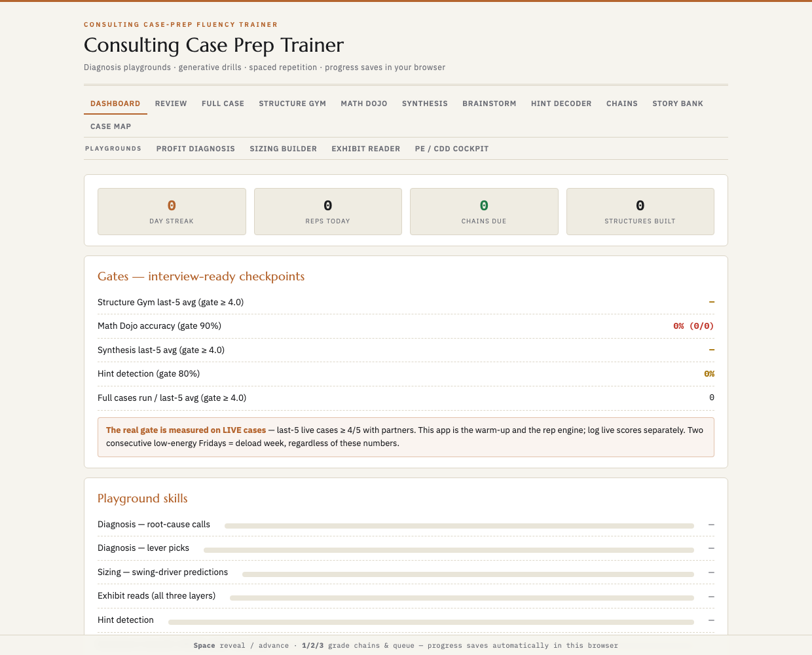

# Consulting Case Prep Trainer

An interactive, spaced-repetition trainer for MBB (McKinsey / BCG / Bain) case interviews — built around the muscle that actually gets tested: hypothesis-driven diagnosis under a limited information budget, not memorized frameworks.

> 📄 **Product write-up:** one of a three-part [Recruiting Trainer Suite](https://github.com/bakulbadwal/ibtrainer) — see the [product case study](https://github.com/bakulbadwal/ibtrainer/blob/main/CASE_STUDY.md) (problem, product decisions, metrics, roadmap).

**Open it:** download `index.html` and open it in any browser — no server, no build, no install.

## What's inside

- **Full Case Run** — a 5-round timed gauntlet (structure → exhibit → math → brainstorm → synthesis) stitching every drill below into one end-to-end mock case, with a debrief scorecard that names your weakest round
- **Profit Diagnosis Game** — a generative engine breaks a randomized business (price erosion, share loss, mix shift, cost inflation...); you get a fixed budget of data pulls to test a hypothesis before calling the root cause, scored on accuracy *and* path efficiency
- **Market-Sizing Builder** — the same prompt built both top-down and bottom-up, with a live convergence check and a predict-first sensitivity tornado
- **Exhibit Reader** — eight generated chart patterns (crossover, mix shift, waterfall, the classic flat-line anti-pattern) drilling observation → so-what → implication under a 60-second clock
- **Brainstorm Gym** — the "what are some ways to..." moment, timed: name your organizing axis first, then fill MECE buckets before the clock runs out
- **PE / CDD Cockpit** — decomposes a target's growth into market beta vs. share alpha vs. margin execution, feeding a linked LBO-lite value bridge — the exact lens MBB uses when it diligences a deal for a sponsor
- **Structure Gym, Math Dojo, Synthesis Trainer, Hint Decoder** — the core recurring drills, weighted to resurface your weaker case types automatically
- **Interviewer chain trees** — real follow-up sequences across profitability, market entry, sizing, pricing, M&A, and synthesis
- **Story Bank** — the other half of the interview: build 4-6 real fit stories with a STAR editor, track theme coverage, and rehearse random fit questions against the clock
- **Spaced repetition** — a Leitner-system review queue tracks every drill and chain node, scheduling weak spots back sooner

## Stack

Single self-contained HTML file. Vanilla JavaScript, no framework, no dependencies, no build step. Progress saves to `localStorage` in whatever browser you open it in — open it the same way each time to keep your streak.

## License

MIT — see [LICENSE](LICENSE).
